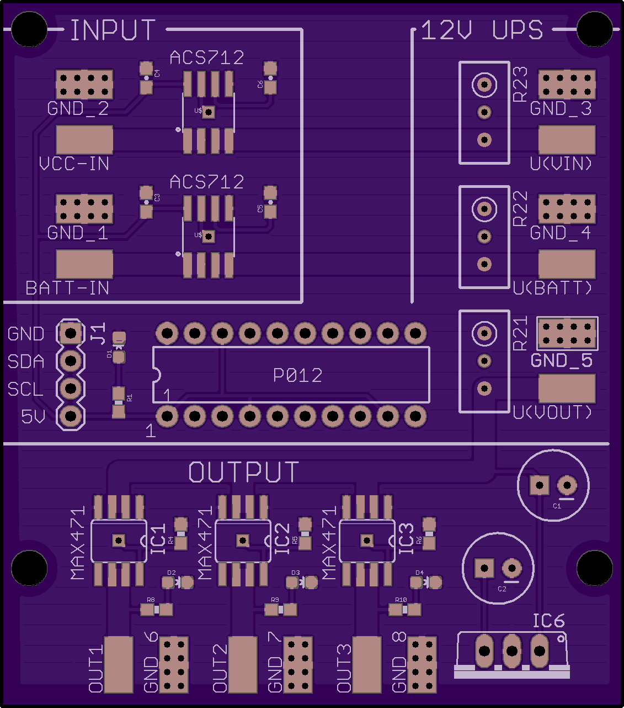

# Documentation

## Design

## Hardware

### Schematics / Board

You can find the schematics and the board design as eagle _.sch_ and _.brd_
files in the [eagle/](eagle/) subdirectory. You can submit the _.brd_ file
directly on http://oshpark.com/ and order it there. It'll be about USD 30,-
for three boards.

NOTE: The board/schematic is untested at this point - boards were ordered
in June 2017, and will go through testing and analysis, after which this
notice will disappear :)

### BOM

You'll need the following (modest) bill of materials to build the UPS
controller board:

*   1x board from http://oshpark.com/
*   1x P012 analog to digital converter speaking I2C, see [ByVac](http://www.pichips.co.uk/index.php/P011_ADC)
*   D1: 1x Blue LED 0603
*   D2,D3,D4: 3x Green LED 0603
*   R1,R4,R5,R6,R8,R9,R10: 7x 1K resistor 0603
*   IC1,IC2,IC3: 3x MAX471CPA (3Amp)
*   IC4,IC5: 2x ACS712-05B (5Amp bidirectional)
*   IC6: 7805
*   C1: 100 uF electrolytic capacitor
*   C2: 10 uF electrolytic capacitor
*   C3,C4: 100nF capacitor 0603
*   C5,C6: 1nF capacitor 0603
*   R21,R22,R23: 10KOhm trim potentiometer
*   J1: M04 dupont header
