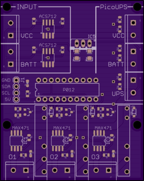
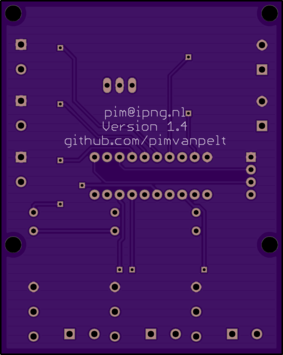

# Introduction

This directory contains additional documentation and thoughts about this project.
I have a bunch of 12V devices in a 19" rack at home -- largely [PC Engines](http://www.pcengines.ch/)
APU1/APU2, a cable modem, and some standalone NAS harddrives. To avoid a 
small battalion of powerbricks, one for each of these (I counted 8 of them
when I started this project), and because I find it a bit sad to use a 220V
UPS to turn a battery into 220V, just to turn it back into 12V DC again by
a powerbrick, I decided to consolidate.

## Design

I wanted to design a system that introspects the 12V power supply: input, output, battery,
is not intrusive, meaning: if it doesn't work, it should "fail open" and simply provide
power to the output ports. When powered/operational, I want to be able to switch off
any given output port (briefly, not necessarily permanently).

## Hardware

For many years I've been using these little [PicoUPS](http://www.mini-box.com/picoUPS-100-12V-DC-micro-UPS-system-battery-backup-system)
devices, which take 15-18V input, connect a sealed lead acid (SLA) 12V battery,
keep that battery charged, while providing protected 15V output to a set of
devices, switching over to the battery if power fails, and switching back
to power, automatically charging the SLA, when it is available. They're
wonderful little devices:

### Requirements

Looking at what I want this system to do:

*   Sense input voltage and current on Vin
*   Sense voltage and current to/from battery on BAT
*   Determine the State of Charge of battery
*   Sense voltage on Vout
*   Have N downstream ports, each of which:
    *   Ability to cycle a port (turn off and on again)
    *   Sense current to the connected device
*   Reliability -- any Arduino / ESP8266 / Foo microcontroller should not perturb operations
*   Connectivity -- system must be on the network, scraped by Prometheus

Specifically the reliability angle is important -- some of the APU2 servers
are critical infrastucture (to me, anyway), as they hold my gateway
functionality, my Subversion server, my serial switch, and my Spongebob
Squarepants collection. I do not want the UPS to fail on me, so I've set
a requirement that no microcontroller is needed at all to operate it. The
MCU will be used only to (a) read the current/voltage values, and (b)
switch ports off, by pulling a normally-closed relais. In other words, the
UPS, if not powered at all, will work just fine, as the relais at rest
simply connects, and when pulled, disconnects the power.

### Electronics

There's a company called [ByVac](http://www.pichips.co.uk/index.php/P011_ADC)
which are not very well known, but they do happen to make a part that fits
really well with my requirements. The P012 chip is an 8-channel 10-bit ADC
which happens to have 3 outputs! It operates between 2.8V and 5.5V, so perfect
for my use case. The chip comes in two versions: **P011** is a serial speaker,
and **P012** is an I2C device. I chose the I2C speaker, because that means
the board, standalone, will be able to be connected to things like a Raspberry
Pi, or a PC Engines APU/ALIX (which I have plenty), or a dedicated MCU.

I'm a big fan of [Espressif](http://www.espressif.com/) which created the
ESP8266 (and later ESP32) microcontrollers. Those are truly marvelous parts,
as they integrate a microcontroller with dozens of GPIO pins; I2C, SPI and
UART busses; and include a fully functional 2.4GHz WiFi radio. It's really
straight forward to use these.

So the mission is to hook up one or more P012s to an ESP8266, and continuously
read the sensor data, presenting that in **/metrics** format for consumption
by [Prometheus](http://prometheus.io/), and accept some form of commands
over the network that allows an operator to turn off an output port, so that
the downstream device resets/reboots.

### Schematics / Board

You can find the schematics and the board design as eagle _.sch_ and _.brd_
files in the [eagle/](eagle/) subdirectory. You can submit the _.brd_ file
directly on http://oshpark.com/ and order it there. It'll be about USD 30,-
for three boards.

NOTE: The board/schematic is untested at this point - boards were ordered
in June 2017, and will go through testing and analysis, after which this
notice will disappear :)

### BOM

You'll need the following (modest) bill of materials to build the UPS
controller board:

*   1x board from http://oshpark.com/
*   1x P012 analog to digital converter speaking I2C, see [ByVac](http://www.pichips.co.uk/index.php/P011_ADC) website
*   D1: 1x Blue LED 0603
*   D2,D3,D4: 3x Green LED 0603
*   R1,R4,R5,R6,R8,R9,R10: 7x 1K resistor 0603
*   IC1,IC2,IC3: 3x MAX471CPA (3Amp)
*   IC4,IC5: 2x ACS712-05B (5Amp bidirectional)
*   IC6: 7805
*   C1: 100 uF electrolytic capacitor
*   C2: 10 uF electrolytic capacitor
*   C3,C4: 100nF capacitor 0603
*   C5,C6: 1nF capacitor 0603
*   R21,R22,R23: 10KOhm trim potentiometer
*   J1: M04 dupont header
